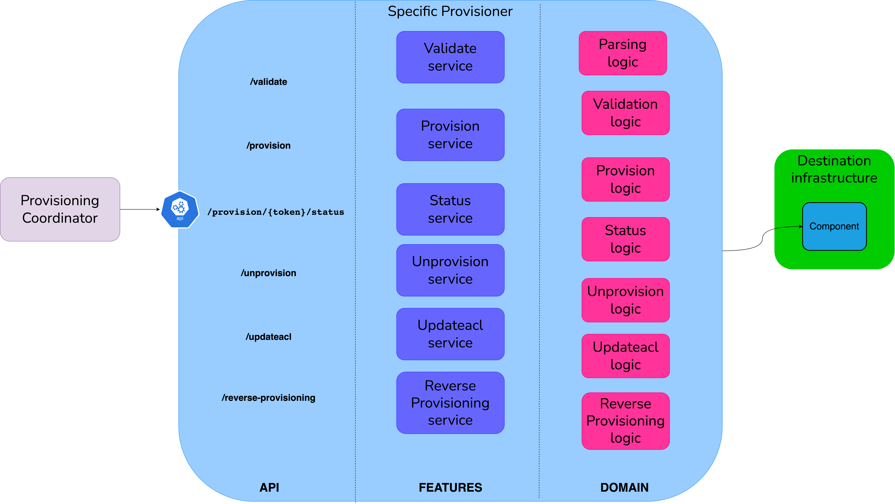
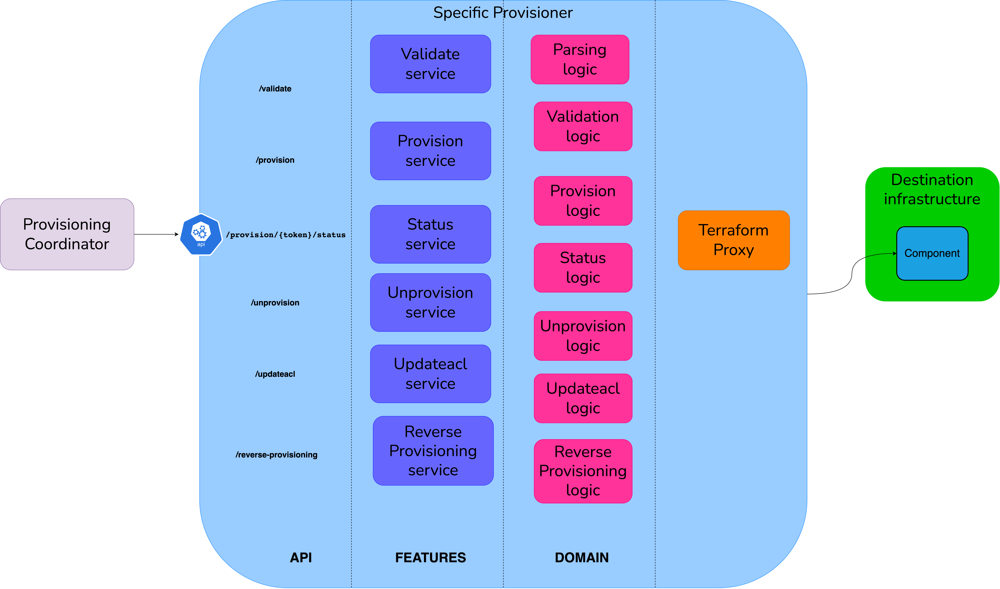

# High Level Design
This document describes the High Level Design of the Terraform Specific Provisioner.
The source diagrams can be found and edited in the [accompanying draw.io file](hld.drawio).

## Overview

### Specific Provisioner
A Specific Provisioner (SP) is a service in charge of performing a resource allocation task, usually
through a Cloud Provider. The resources to allocate are typically referred to as the _Component_, the
details of which are described in a YAML file, known as _Component Descriptor_.

The SP is invoked by an upstream service of the Witboost platform, namely the Coordinator, which is in charge of orchestrating the creation
of a complex infrastructure by coordinating several SPs in a single workflow. The SP receives
the _Data Product Descriptor_ as input with all the components (because it might need more context) plus the id of the component to provision, named _componentIdToProvision_

To enable the above orchestration a SP exposes an API made up of five main operations:
- validate: checks if the provided component descriptor is valid and reports any errors
- provision: performs the resource allocation specified by the descriptor previously validated
- status: returns the status of the provisioning process, an identifier of which is provided as input
- unprovision: destroys the resources previously allocated.
- updateacl: grants access to a specific component/resource to a list of users/groups

The figure below shows the logical architecture of a specific provisioner. The API layer leverages an underlying layer of services that implements the business logic.

### Terraform
Terraform is an open-source infrastructure-as-code software tool created by HashiCorp. Users define and provide data center infrastructure using a declarative configuration language known as HashiCorp Configuration Language (HCL), or optionally JSON.

#### Design
Terraform manages external resources (such as public cloud infrastructure, private cloud infrastructure, network appliances, software as a service, and platform as a service) with `providers`. HashiCorp maintains an extensive list of official providers, and can also integrate with community-developed providers. Users can interact with Terraform providers by declaring resources or by calling data sources. Rather than using imperative commands to provision resources, Terraform uses **declarative configuration to describe the desired final state**. Once a user invokes Terraform on a given resource, Terraform will perform CRUD actions on the user's behalf to accomplish the desired state. The infrastructure as code can be written as `modules`, promoting _reusability_ and _maintainability_.

### Integration

Terraform integration for managing infrastructure components allows the same codebase to be used at all times. What changes from provisioner to provisioner is the Terraform code needed to handle the specific component.

## Validation
To enable users to create SPs based on this one without writing code, we should provide a way to define validation rules in a declarative way.

### CUE
[CUE](https://cuelang.org/) is an open-source data validation language and inference engine with its roots in logic programming. Although the language is not a general-purpose programming language, it has many applications, such as data validation, data templating, configuration, querying, code generation, and even scripting. The inference engine can be used to validate data in code or to include it as part of a code generation pipeline.

### Terraform
In addition to CUE, we could use also the Terraform `validate` command. Validate runs checks that verify whether a configuration is syntactically valid and internally consistent, regardless of any provided variables or existing state.

## Provision and unprovision
The provisioning and unprovisioning operations are responsible for actually setting up the resources needed on the target systems.

The user needs to write a Terraform module responsible for managing the desired component.

Then:
- the `provision` request is translated to an `apply` operation on Terraform side
- the `unprovision` request is translated to a `destroy` operation

### Mapping from descriptor values to TF variables
Terraform input variables let you customize aspects of Terraform modules without altering the module's source code. This functionality allows you to share modules across different Terraform configurations, making your module composable and reusable.
When you declare variables in the root module of your configuration, you can set their values using CLI options and environment variables.

We should allow the user to define a configurable mapping so that we can take the values from any part of the deployment descriptor.

For this purpose, we use the [JsonPath](https://github.com/json-path/JsonPath) library.
With this library, we allow the user to define a mapping such as:

| Terraform variable name | Json Path                                                                        |
|-------------------------|----------------------------------------------------------------------------------|
| prefix                  | $.dataProduct.fullyQualifiedName                                                 |
| name                    | $.dataProduct.components[?(@.id == "id")].specific.container.name                |
| path                    | $.dataProduct.components[?(@.id == "id")].specific.container.directories[0].path |

## Multi-module

This feature aims to reduce the number of microservices that need to be deployed, enabling the use of multiple TF modules from a single SP. Otherwise, you can end up with a lot of microservices each with a single TF module that all provision resources for the same technology.

Using the `useCaseTemplateId` field from the descriptor as a key, we have a configurable mapping with the module to use (more precisely its path) that is completely managed by the platform team.

### State management

Each module must handle its own state management, making sure to appropriately segregate DP components with a reasonable `state key` to avoid collisions and use a fault-tolerant and lockable `state store` (remote backends, such as Amazon S3, Azure Blob Storage, or HashiCorp Consul, are a good fit as they provide also better collaboration and security).